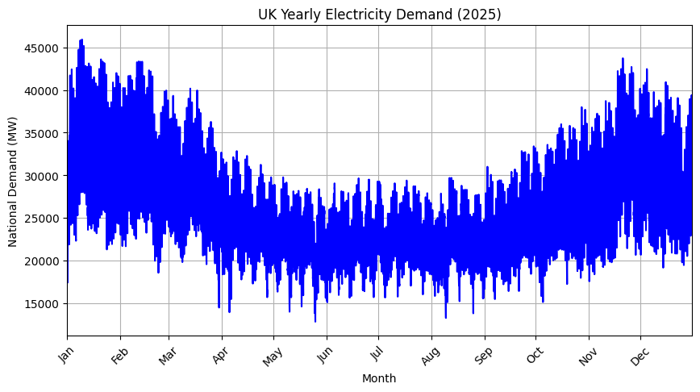
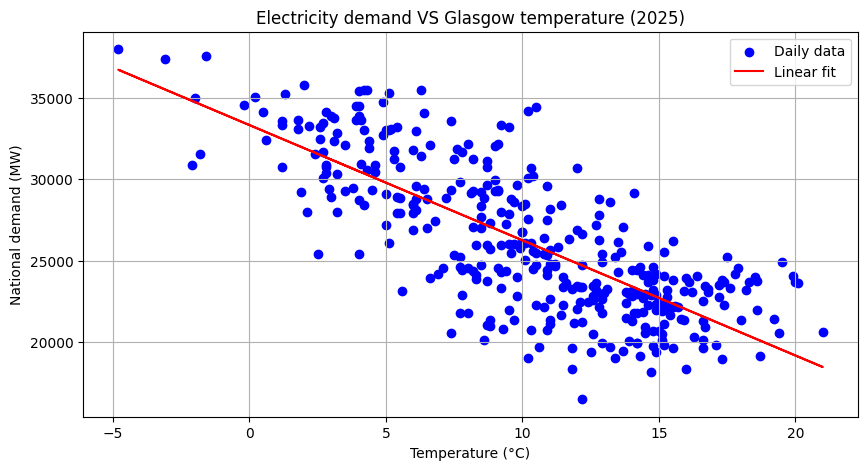
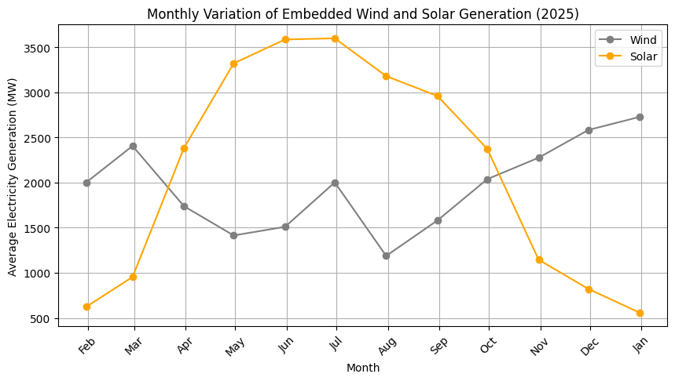
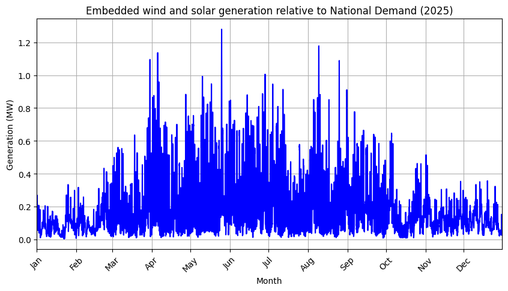

# UK Electricity Demand and Renewable Energy Analysis using Python
Exploring UK electricity demand using National Grid data and Meteostat weather observations. Analysis includes seasonal demand patterns, temperature relationships and embedded renewable generation using Python.

## Skills demonstrated
- Python
- Pandas
- NumPy
- Matplotlib
- Exploratory data analysis
- Data visualisation

## Data sources
- National Grid ESO Open Data Portal – Half-hourly GB electricity demand data (2025).
- Meteostat – Daily weather observations for Glasgow (2025).

## Key Findings
- Electricity demand follows seasonal patterns.
- Winter demand is generally higher than other seasons.
- Lower temperatures relate to increased electricity demand.
- Embedded solar generation follows daily and seasonal trends while embedded wind generation is irregular.

## Example Visualisations

### Electricity demand over time

### Electricity demand vs temperature

### Embedded solar and wind generation over time

### Ratio of national demand provided by embedded solar and wind generation

## Future Improvements
- Include total renewable generation data.
- Analyse regional demand differences.

## Author
Eilidh Anderson
BSc Physics with Astrophysics
Univeristy of Glasgow

Eilidh Anderson
Physics with Astrophysics
University of Glasgow
